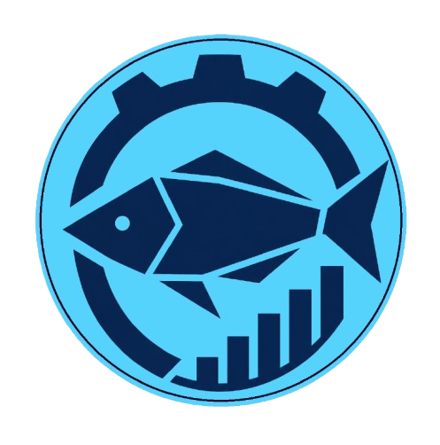

<div align="center">
  

  <h1>guias-produccion</h1>

  <p>
    Sistema de control de produccion pesquera con escritorio multiplataforma (Tauri)
    y frontend web (React + Vite). Gestiona catalogos, variantes de producto,
    movimientos de inventario y reportes de stock.
  </p>

  <p>
    
    
    
    
    
    
  </p>
</div>

---

## Caracteristicas

- Autenticacion con usuarios y JWT (registro, login, rutas protegidas)
- Catalogos base: especies, presentaciones, formas de envasado, formas de empacado, calidades y calibres
- Variantes de presentacion combinando catalogos (codigo completo generado en vista SQL)
- Movimientos de inventario: ingresos y salidas, con paginacion
- Importacion masiva CSV para ingresos y salidas
- Consultas de stock actual por variante
- Reportes exportables en CSV: movimientos, stock actual, consolidado por especie
- Dashboard con estadisticas y alertas de stock critico

## Stack

- Frontend: React 19, React Router, React Hook Form, Zod, Zustand, Tailwind
- Desktop: Tauri 2
- Backend local: Rust + libsql (Turso)
- Reportes PDF: jsPDF (utilidades en frontend)

## Estructura

```
src/
  components/   UI, formularios y listados
  pages/        vistas principales (dashboard, catalogos, ingresos, salidas, stock, reportes)
  services/     llamadas Tauri (invoke) y autenticacion
  stores/       estado global (auth)
src-tauri/
  src/          comandos Tauri y acceso a base de datos
  db/           schemas, queries y vistas
```

## Requisitos

- Node.js 18+
- Rust (toolchain estable)
- Tauri CLI v2
- Cuenta/BD Turso (libsql remoto)

## Variables de entorno

Crea un archivo .env en src-tauri/ con estas variables:

```
TURSO_DATABASE_URL=libsql://<tu-instancia>.turso.io
TURSO_AUTH_TOKEN=<token-de-acceso>
JWT_SECRET=<secreto-jwt>
```

## Instalacion

```
npm install
```

## Desarrollo

```
# frontend
npm run dev

# desktop (Tauri)
npm run tauri dev
```

## Build

```
# build web
npm run build

# build desktop
npm run tauri build
```

## Flujo recomendado

1. Registrar especies
2. Registrar presentaciones por especie
3. Completar catalogos (envasado, empacado, calidades, calibres)
4. Crear variantes
5. Registrar ingresos y salidas
6. Consultar stock y exportar reportes

## Notas de arquitectura

- La base de datos se inicializa al arrancar la app Tauri: crea tablas, vistas e indices.
- Las vistas SQL generan el codigo completo de variante a partir de catalogos.
- Las llamadas a backend se realizan via @tauri-apps/api con token JWT.

## Scripts

- npm run dev: servidor Vite
- npm run build: build del frontend
- npm run preview: preview del build
- npm run tauri: comandos Tauri (ej: npm run tauri dev)

## Licencia

Este proyecto está bajo licencia MIT. Ver [LICENSE](LICENSE).
